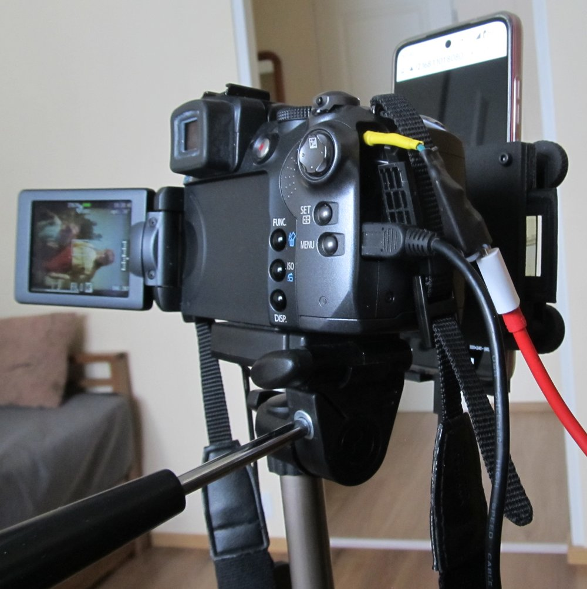
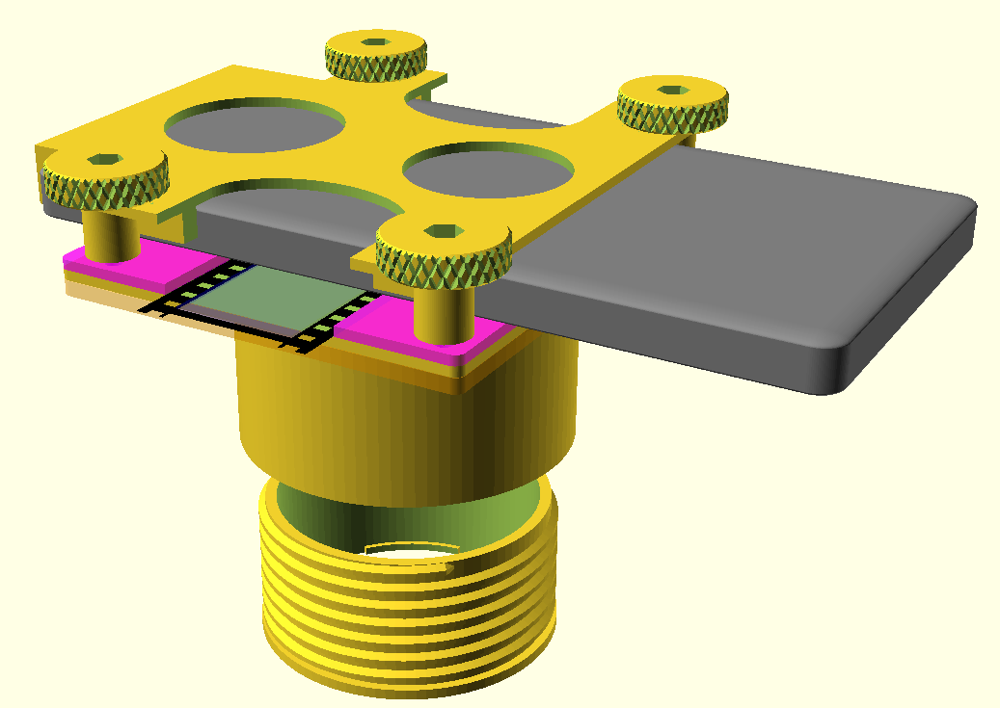
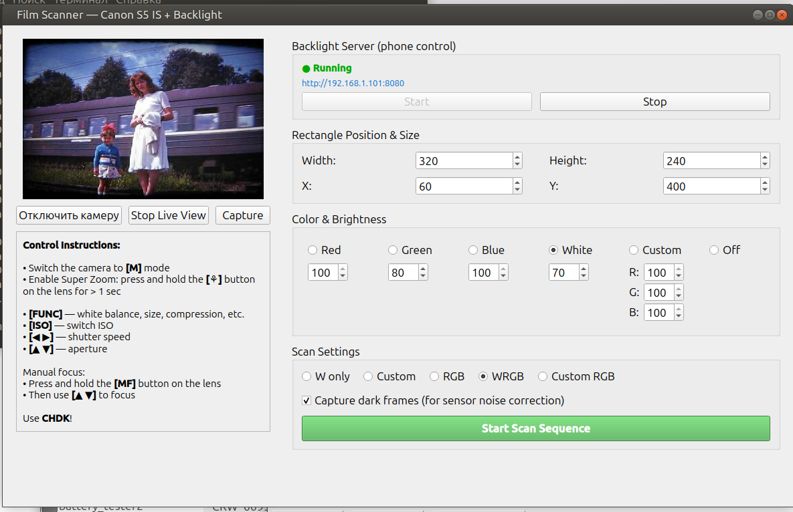
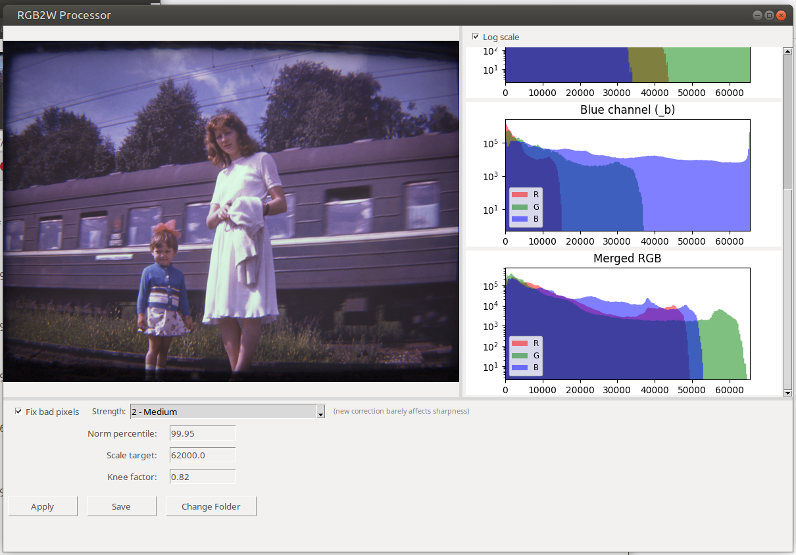

# DIY RGB Film Scanner — Canon PowerShot S5 IS + Smartphone OLED

**High-quality 35mm slide/negative digitization on a budget**

Uses a cheap used Canon PowerShot S5 IS (€20–30), CHDK, sequential RGB (or WRGB) backlight from any OLED phone, and fully open-source Python tools.

## Why this project?

- Professional-level results without spending €1000+ on a dedicated film scanner  
- Bypasses Bayer filter limitations by shooting separate full-resolution RAW frames for each color channel  
- Excellent dynamic range and color accuracy thanks to RAW control and dark-frame subtraction  
- Everything is 3D-printable and costs almost nothing beyond the old camera

## Key Advantages of the S5 IS for this task

- Super Macro mode allows focusing extremely close → very simple mechanical design with no stray light  
- Large enough sensor (1/2.5") and 8 MP resolution ideal for film (larger files from 20+ MP bring mostly noise)  
- CHDK enables reliable RAW shooting — essential for proper RGB channel combination

## Features

### Hardware
- Complete parametric OpenSCAD model (film holder for 35mm, lens adapter, phone mount, tension bolt/nut system)  
- Uses the camera in Super Macro mode — no complex optics required

### Scanning Software (`python/Film_scanner/film_scanner.py`)
- Live view from the camera via gPhoto2  
- One-click scan sequences: **White only**, **RGB**, **WRGB**, **Custom**, **Custom RGB**  
- Built-in web server — control the RGB backlight rectangle and brightness directly from your phone browser  
- Automatic saving of RAW + JPEG with smart naming and optional dark frames  
- Dark frame support for noise subtraction

### RGB2W Processor (`python/rgb2w/rgb2w_gui.py`)
- Automatic dark-frame subtraction  
- Optional bad-pixel correction (5×5 median filter)  
- Spectral sensitivity compensation  
- 99.95% percentile normalization + soft highlight roll-off (preserves highlight structure)  
- Outputs: `_rgb.tiff` (16-bit), `_w.tiff` (16-bit), `_rgb.jpg`

### TIFF Crop Tool (`python/tiff_crop/tiff_crop.py`)
- Lossless 16-bit crop and 90° rotation (preserves full bit depth)  
- Interactive crop rectangle with fixed aspect ratios (1:1, 3:4, 4:3)  
- Saves with zlib compression

